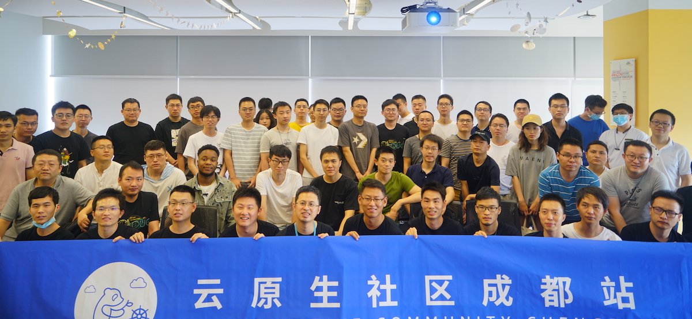

# 云原生社区 meetup 第五期成都站

- 时间：2021 年 7 月 3 日
- 地点：四川省成都市高新区银泰城 4 号楼 13 层
- 主持人：粟伟

## 话题

- 开场演讲：欢迎来到云原生社区成都站，宋净超，云原生社区创始人、Tetrate 布道师
- Amazon EKS Distro 开源项目解析&演示，粟伟，亚马逊云科技资深解决方案架构师
- 面向量化投资的AI平台——AI赋能投资：打造以大数据+AI为核心的下一代投资平台，梁举，宽邦科技 CEO
- 基于 TiDB 的云原生数据库实践，王天宜，TiDB 社区部门架构师
- Layotto:开启服务网格+应用运行时新篇章，石建伟（卓与），蚂蚁集团高级技术专家

视频回放见 [B 站](https://space.bilibili.com/515485124/channel/detail?cid=189955)。