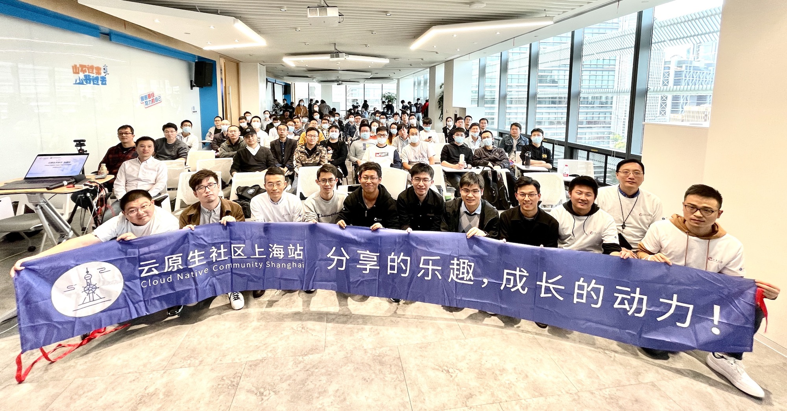

# 云原生社区 meetup 第 8 期上海站

- 时间：2021 年 10 月 23 日
- 主持人：郭旭东
- 地点：上海蚂蚁 S 空间
- 详见：[活动行](https://cloudnative.huodongxing.com/event/6619412646200)
- [PPT 下载](https://github.com/cloudnativeto/academy/tree/master/meetup/08-shanghai)

## 讲师分享

- [云原生社区 meetup 第八期上海站开场，郭旭东](https://www.bilibili.com/video/BV1tP4y1L7rs)
- [云原生 2.0 华为云赋能 “新云原生企业”，张凯豪](https://www.bilibili.com/video/BV1Xq4y197Su)
- [蚂蚁万级规模 K8s 集群 etcd 架构优化实践 —ETCD on OceanBase，宣超](https://www.bilibili.com/video/BV1i44y1v7fM)
- [新一代开源 HCI 底层原理剖析，胡凯](https://www.bilibili.com/video/BV17Q4y1q79o)
- [攀登规模化的高峰 —— 蚂蚁集团大规模 Sigma 集群 ApiServer 优化实践，唐博，谭崇康](https://www.bilibili.com/video/BV1uf4y137xC)
- [云原生分布式存储 Rook 及其在企业中应用的未来，林文炜](https://www.bilibili.com/video/BV1fq4y1G7qD)
