# 可观测性峰会 2023 回顾及 PPT 下载

「可观测性峰会 2023」是云原生社区组织的技术会议，旨在分享并探讨云原生应用程序和基础架构中实现可观测性的最新技术和工具以及最佳实践。

时间：2023 年 4 月 22 日（周六）

地点：北京奥佳美术馆酒店

活动详情：https://www.huodongxing.com/event/6695157778700

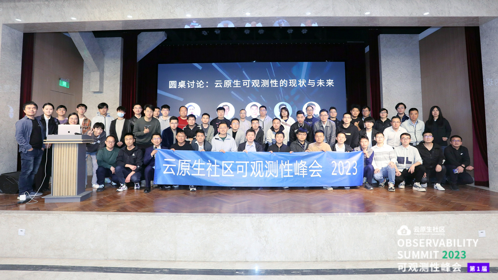

本次大会的主持人来自云原生社区管委会，上半场主持人为罗广明。

下半场主持人张丽颖。

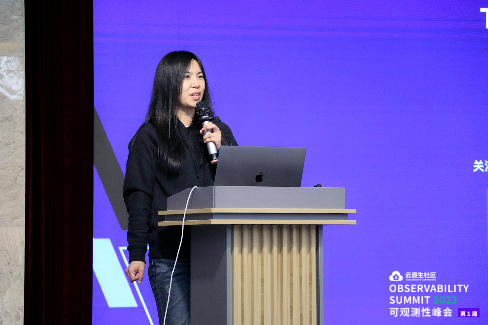

### 开场致辞

嘉宾：

宋净超，云原生社区创始人

陈屹力，中国信通院云大所副总工程师

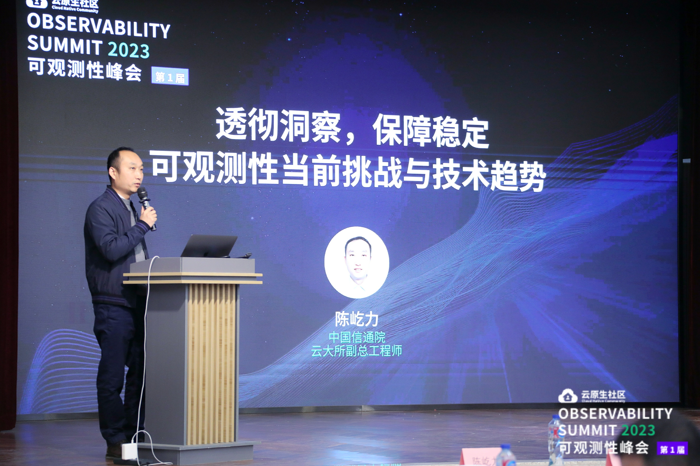

视频链接：[https://www.bilibili.com/video/BV1zV4y1o79E/](https://www.bilibili.com/video/BV1zV4y1o79E/)

### 可观测性OpsCenter在移动云平台落地实践

沈巍，中国移动云能力中心架构师

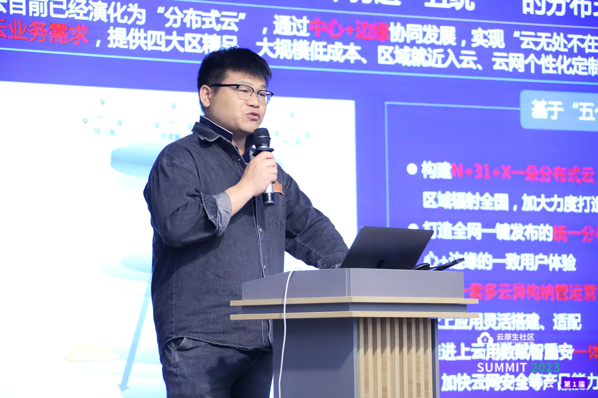

**讲师介绍**

沈巍，中国移动云能力中心，软件开发工程师，曾就职于全球最大的移动通信设备商爱立信；在爱立信工作期间参与设计了爱立信全球第一套超大规模NFV电信云落地，全球第一套超大规模5GC电信云落地；荣获爱立信年度最具有价值员工称号。擅长openstack，kubernetes等云平台的解决方案设计与实现；云平台可观测性监控的设计与实现。

**议题概要**

1. 介绍移动云的现状，包括资源池和设备供应商的多样性以及网络设备和网络结构存在的问题。
2. 针对移动云的现状，提出了适合移动云的可观测性平台的解决方案和实现方法。其中，介绍了监控数据来源（包括分层级监控和分应用监控），告警分发策略和主动运维的必要性。
3. 探讨了部署可观测性平台的收益和价值性。

视频链接：[https://www.bilibili.com/video/BV1GX4y1B7qG/](https://www.bilibili.com/video/BV1GX4y1B7qG/)

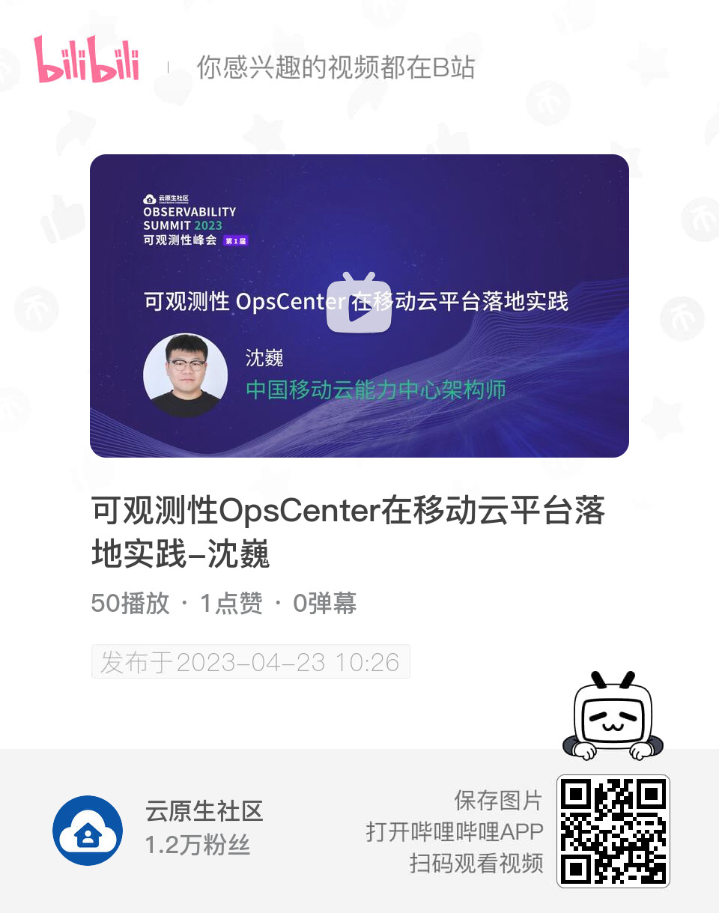

### 使用 eBPF 零代码修改绘制全景应用拓扑

向阳，云杉网络

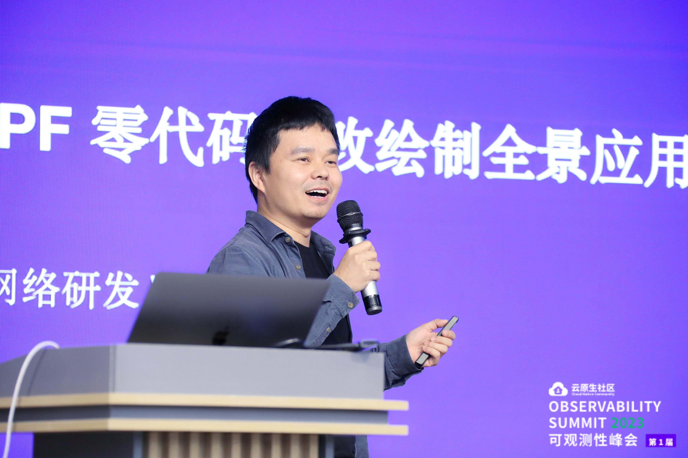

**讲师介绍**

向阳，云杉网络研发 VP，清华大学博士。致力于打造一款零侵扰的云原生应用可观测性产品，让观测更自动，让开发者更自由。

**议题概要**

云原生应用访问关系错综复杂、更新频繁，依靠手动绘制不现实，依靠代码插桩或服务网格侵入性大难以覆盖全景。DeepFlow 利用 eBPF 实现了无需代码修改、无需应用重发布、无需业务进程重启的全景应用拓扑绘制能力，并在拓扑之上提供了所有服务、所有访问路径的全栈性能指标。

视频链接：[https://www.bilibili.com/video/BV1B14y1f7UB/](https://www.bilibili.com/video/BV1B14y1f7UB/)

### 可观测技术应用现状及发展趋势研究

高继翔，中国信通院

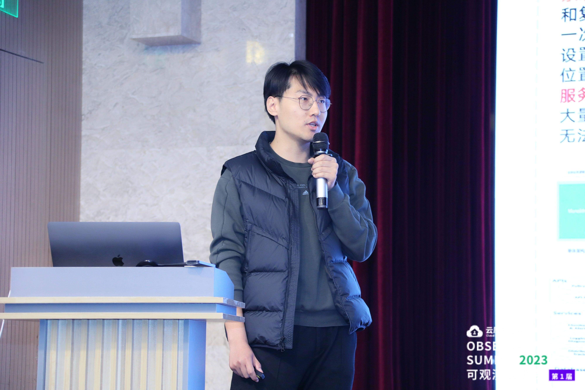

**讲师介绍**

高继翔，中国信通院云大所业务主管，从事可观测性、SRE等云计算领域关键技术研究，牵头编写了《可观测性技术 平台能力分级要求》行业标准。

**议题概要**

支撑工信部在31个省市开展云服务稳定安全运行应急演练专项活动过程中，对可观测性技术应用现状的调查结果，同时结合产业研究成果，介绍可观测性技术发展趋势及方向。

视频链接：[https://www.bilibili.com/video/BV1xv4y1E7wF/](https://www.bilibili.com/video/BV1xv4y1E7wF/)

### 圆桌讨论：云原生应用可观测性现状及趋势

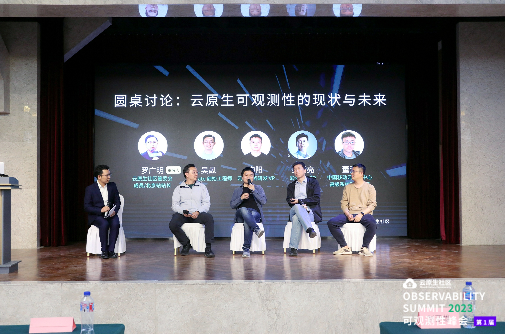

**嘉宾**

- 罗广明，主持人
- 吴晟，Tetrate 创始工程师
- 向阳，云杉科技研发 VP
- 乔新亮，原苏宁科技副总裁，现彩食鲜 CTO
- 董江，中国移动云能力中心高级系统架构专家

**讨论话题**

1. 云原生大背景之下，可观测性为什么如此重要？
2. 如何评估云原生应用程序和基础设施的可观测性水平？
3. 未来云原生可观测性的发展趋势是什么？将来可观测性的实现方式和手段会有哪些变化？

视频链接：[https://www.bilibili.com/video/BV1is4y1d7gd/](https://www.bilibili.com/video/BV1is4y1d7gd/)

---

### 基于 Prometheus 的 SLO 告警实战

宋佳洋，Oppo

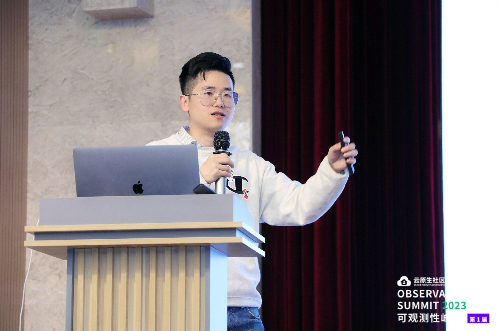

**讲师介绍**

宋佳洋，OPPO 高级后端工程师，OpenTelemetry 、Prometheus、Cortex 代码贡献者。2013 年参加工作，先后就职于七牛云、京东云等公司，目前就职于 OPPO 云计算部门。爱好 Golang 和开源，目前主要专注于云原生和观察性领域。

**议题概要**

1. 基于 SLO 告警基础
2. 开源方案对比（Sloth、Pyrra）
3. 多租户 SLO 实现方式（Cortex 扩展）
4. 遥测塔 SLO 服务介绍
5. Demo 展示

视频链接：[https://www.bilibili.com/video/BV1jV4y1o7Q7/](https://www.bilibili.com/video/BV1jV4y1o7Q7/)

### 为 Apache SkyWalking 构建 Grafana dashboards -- 基于对原生 PromQL 的支持

万凯，Tetrate

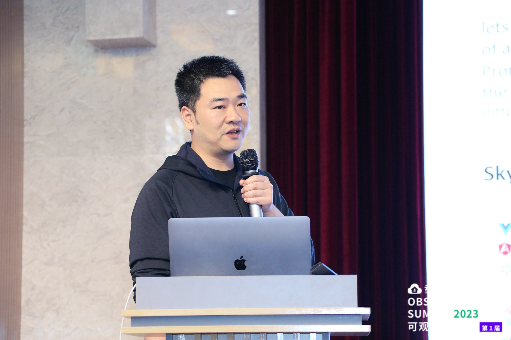

**讲师介绍**

万凯，Tetrate 工程师，Apache SkyWalking PMC 成员，专注于应用性能可观测性领域。

**议题概要**

本次分享将介绍 Apache SkyWalking 的新特性 PromQL Service，它将为 SkyWalking 带来更广泛的生态集成能力:

- 什么是 PromQL
- SkyWalking 的 PromQL Service 是什么，能够做什么
- SkyWalking 中的基本概念和 metrics 的特性
- 如何使用 PromQL Service
- 使用 PromQL Service 构建 Grafana dashboards 的实践

视频链接：[https://www.bilibili.com/video/BV1ms4y1d7NF/](https://www.bilibili.com/video/BV1ms4y1d7NF/)

### Apache Dubbo 云原生可观测性的探索与实践

江河清，阿里巴巴

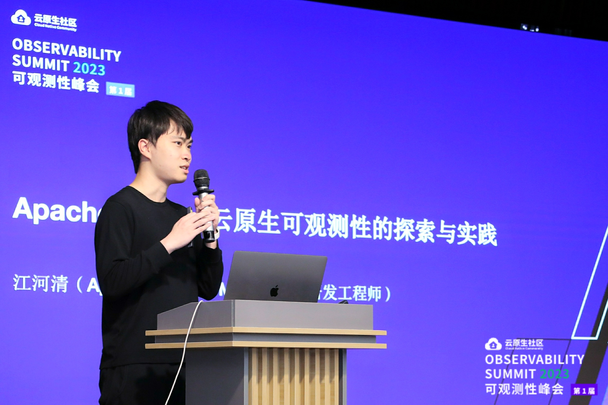

**讲师介绍**

Apache Dubbo PMC，阿里云研发工程师，专注于服务框架，Apache Dubbo 核心维护团队成员。

**议题概要**

1. 云原生背景下传统微服务应用的架构升级
2. 云原生微服务场景下可观测性的价值
3. Apache Dubbo 对接可观测体系的思路和目标
4. Apache Dubbo 基于 Micrometer 实现实时指标采集和全链路追踪方案的介绍
5. Apache Dubbo 通过 OpenTelemetry 对接可观测平台的方案
6. 基于可观测能力提升生产稳定性的最佳实践介绍

视频链接：[https://www.bilibili.com/video/BV1mV4y1o7Uj/](https://www.bilibili.com/video/BV1mV4y1o7Uj/)

### 我为可观测性做减法：微信日志热点约简实践与探索

余广坝，中山大学

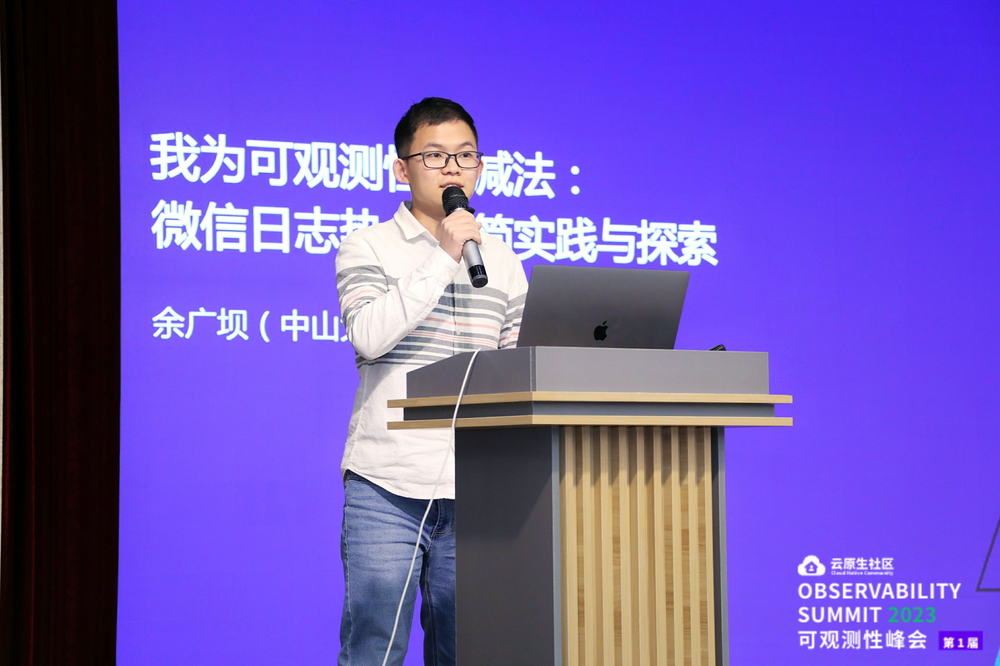

**讲师介绍**

余广坝，中山大学2020级计算机专业的博士研究生，研究方向为云原生系统的性能诊断与优化，累计发表学术论文20余篇，其中 包括CCF A 类论文 4 篇。2022 年入选 2022 腾讯犀牛鸟精英人才计划，到腾讯 WXG 做科研实习生，主要研究微信后台日志约简话题。此次分享的话题对应学术论文被 CCF A 类国际软件工程大会 ICSE 2023 录用。

**议题概要**

在微信中，每天的后台日志打印接近100万亿行，占用了接近20PB的存储，带来了巨大的运营成本。为了削减日志的运营成本，我们对微信后台的日志打印和存储的特征进行了分析和挖掘，发现「绝大多数的日志开销是由少数的几条日志语句导致的」，我们将这些日志语句称为「日志热点」。这个发现启发我们：「及时发现日志热点，对日志热点的打印进行优化即可降低大量的日志开销」。针对这个问题，他将分享以下几个话题：

- 微信后台日志热点出现的普遍性、原因和修复方案调研
- 微信日志热点定位与离线约简实践
- 基于eBPF的在线日志热点约简探索

视频链接：[https://www.bilibili.com/video/BV1Ec411J7sk/](https://www.bilibili.com/video/BV1Ec411J7sk/)

### 使用 eBPF+WASM 构建下一代可观测性数据采集基础设施

赵亚雄，三度观测云（tricorder.dev）创始人 CEO

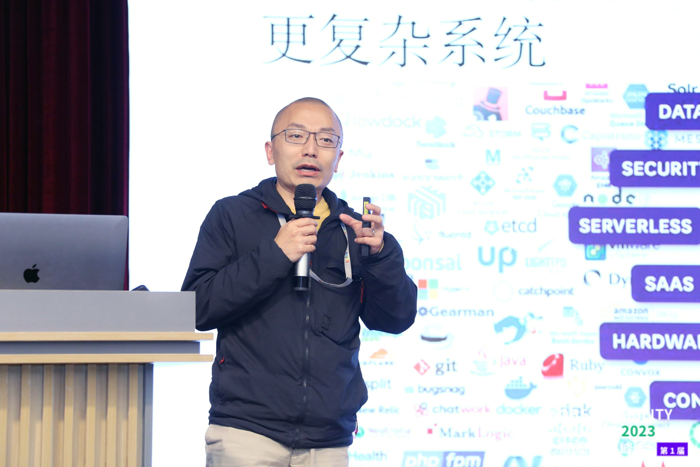

**讲师介绍**

赵亚雄博士 2012 - 2013 年参与 Amazon Kinesis 开发（世界首个流式大数据云服务）；2013 - 2019 年先后在 Google NetInfra 团队参与 Jupiter 软件定义网络系统、及 Borg 容器云平台的研发，后期担任 Borg Clients 团队经理，承担下一代云原生自动化运维系统的研发；2019 - 2022 年是 Pixie（[https://px.dev](https://px.dev/)）创始团队成员，Pixie 获得顶级风投 Benchmark、GV 投资，于 2020 年 12 月被纽约证券交易所上市公司 New Relic（[https://newrelic.com/）收购，历时仅](https://newrelic.com/%EF%BC%89%E6%94%B6%E8%B4%AD%EF%BC%8C%E5%8E%86%E6%97%B6%E4%BB%85) 1.5 年；2022 年 10 月创立三度观测云，从全球超过 5000 家申请企业中脱颖而出、获选进入奇绩创坛创业营，并获得陆奇博士天使轮投资。

**议题概要**

议题简介
可观测性是云原生技术版图中的核心，是支撑云原生软件系统开发、运维的基础。可观测性技术的本质是通过数据来揭示软件系统自身的运行机制，提升和扩展工程师在云原生环境中进行软件开发、测试、运维的能力边界。

数据是可观测性的基础和价值源泉。但是，针对可观测性数据采集，可观测性技术群体沿用了一条错误的技术路线：各类可观测性产品须在被观测的软件系统内植入代码来采集可观测性数据，好比是做体检都需要开膛破肚。这种方式从根本上增加了可观测性产品的使用成本，限制了可观测性技术发挥价值的空间，降低了可观测性技术在云原生生态中的普及速度；甚至阻碍了云原生技术自身的普及。      

赵亚雄博士介绍了基于 eBPF+WASM 实现无侵入式数据采集的技术思想，从根本上降低可观测性数据采集的成本，符合云原生技术自身技术规律；以此技术思想为指导，星舰（Starship）观测平台在 Kubernetes 上实现了可观测性数据即时采集，助力工程师获取高价值数据，解决云原生软件系统的开发、测试、运维过程中的各类技术问题。

视频链接：[https://www.bilibili.com/video/BV1kM411V7Y9/](https://www.bilibili.com/video/BV1kM411V7Y9/)

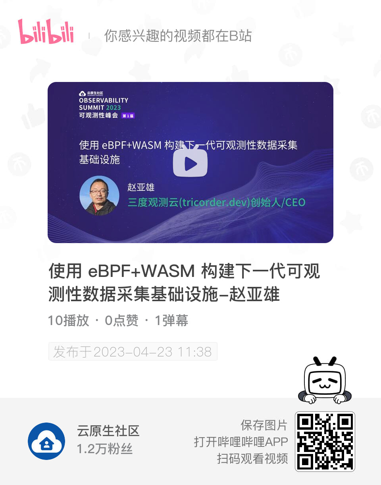

### 大会总结

本次可观测性峰会2023在北京奥加美术馆酒店圆满结束。本次峰会聚焦于云原生应用程序和基础架构中可观测性的最佳实践。上午场聚焦最佳实践和经验分享，并围绕可观测性进行了精彩的讨论，下午场的五场分享展示了最新的技术和工具，为参会者带来了许多宝贵的经验和启示。

其中，基于Prometheus的SLO告警实战分享了如何在实践中应用SLO告警基础，使得告警更加准确；Apache SkyWalking的分享介绍了其新特性PromQL Service，展示了如何使用SkyWalking中的PromQL Service构建Grafana dashboards；Apache Dubbo的分享介绍了在云原生微服务场景下可观测性的价值和Dubbo对接可观测体系的思路和目标；微信日志热点约简实践与探索分享了如何通过发现日志热点对日志打印进行优化从而降低日志开销；使用eBPF+WASM构建下一代可观测性数据采集基础设施分享了基于eBPF+WASM实现无侵入式数据采集的技术思想。

参会者对本次峰会的内容表示非常满意，认为分享的内容新颖、实用，有助于他们更好地应用可观测性技术。此外，本次峰会的社区影响力也得到了一致的肯定，参会者表示，这是一次非常成功的活动，期待未来的峰会能够继续展示最新的技术和工具，为业界带来更多的启示和收获。

本次可观测性峰会2023是一次非常成功的活动，为业界带来了许多启示和收获，展示了最新的技术和工具，同时也促进了社区的发展和交流。希望未来的峰会能够继续为业界带来更多的启示和收获，展示最新的技术和工具，为可观测性技术的发展和应用做出更大的贡献。

## PPT 下载

讲师 PPT 可以在 GitHub 上下载，下载链接：<https://github.com/cloudnativeto/academy>